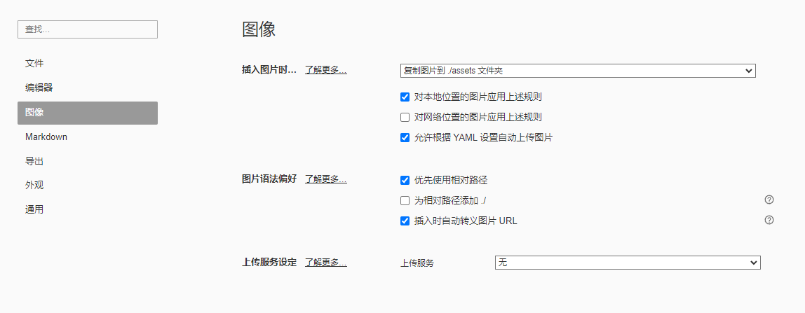

# 解决GitHub无法显示图片的问题

### 以管理员身份运行cmd

1. win+R

2. 输入cmd

3. ctrl+shift+enter以管理员身份运行cmd

   

### cmd中执行notepad C:\Windows\System32\drivers\etc\hosts以记事本打开hosts文件

### 在hosts里面添加以下IP映射并保存（提高访问速度）

199.232.68.133 raw.githubusercontent.com
199.232.68.133 githubusercontent.com

185.199.108.133 raw.githubusercontent.com
185.199.109.133 raw.githubusercontent.com
185.199.110.133 raw.githubusercontent.com
185.199.111.133 raw.githubusercontent.com

typora配置

