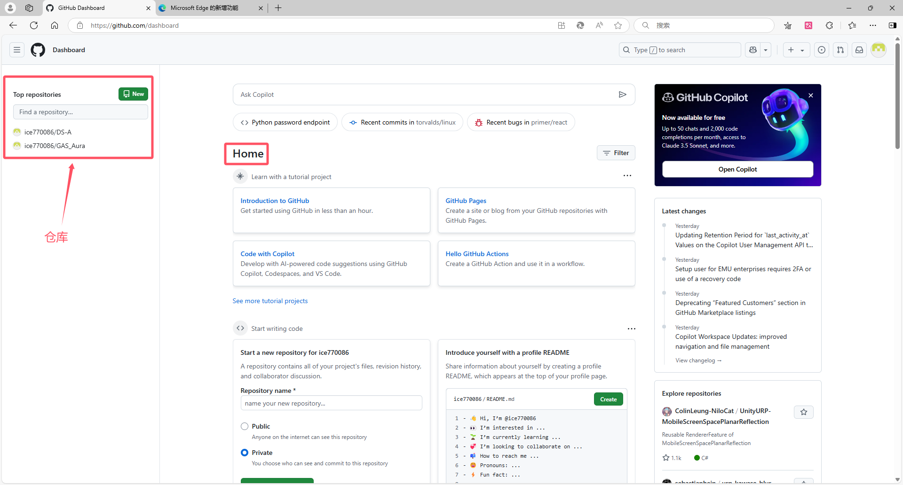
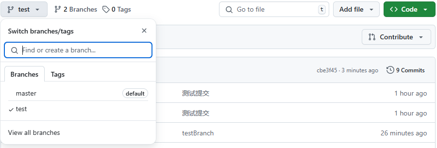
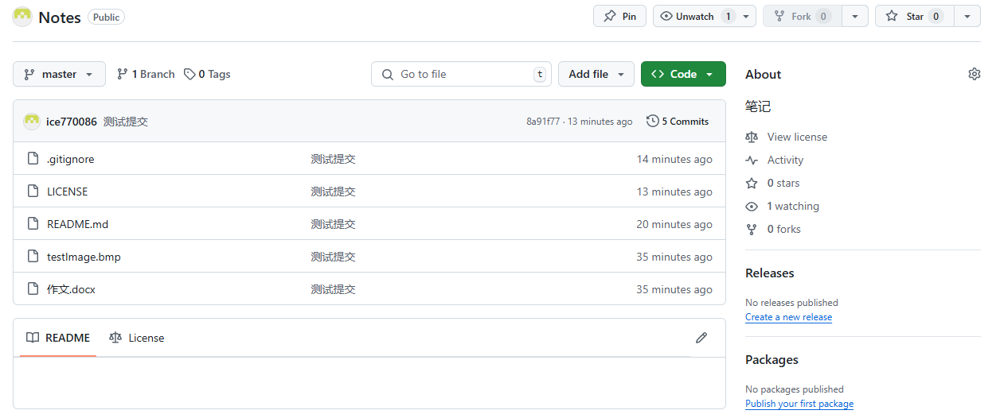

# GIT版本控制

git是使用git命令管理项目

代码托管平台有：github，gitee

githubdesktop是github的桌面版


新建github仓库




分支管理

每个分支都是独立的副本，互不干扰，共享一个远程仓库

每次提交都有一个哈希值来标识


## 管理本地仓库

- #### 提交与恢复

```git
git init	//初始化当前目录为git仓库

git add		//把文件放入暂存区
git add.	//当前目录的所有文件放入暂存区
git stauts	//查看暂存区
git reset <文件名>	//把目标文件移出暂存区，HEAD是最新提交的指针
git reset <哈希值>	//提交后才有哈希值，能回退到提交前的状态

git commit	//把暂存区的文件提交到本地仓库，-m "提交说明"
git log		//查看历史提交和哈希值
```


- #### 分支管理

```git
git branch <新分支名>		  	//创建分支，新分支不认识其他分支的远程仓库别名
git branch					//查看分支（当前分支*标识）
git branch -D <分支名>			//强制删除分支

git reflog					//查找分支哈希值
git branch <分支名> <哈希值>	//恢复指定哈希值对应的分支

git checkout <分支名>			//切换分支
git merge <要整合过来的分支名>	//整合到当前分支
```





## 管理远程仓库

```git
git remote add origin  <url>	//添加远程仓库地址，以后使用别名origin即可表示远程仓库地址
git push origin master			//把本地master分支推送到远程仓库master分支
git push -u origin master		//用了-u以后推送直接git push就行

git pull origin master			//从origin对应仓库中拉取master分支合并到本地
git remote -v					//查看远程仓库
git remote rm <别名>				//删除远程仓库别名，仓库本身还在
```


- #### 创建远程仓库并起别名然后查看远程仓库（push是推送，fetch是拉取）


- #### 发送到远程仓库出错

这个问题是由于没有配置信任的服务器HTTPS验证。默认，[cURL](https://so.csdn.net/so/search?q=cURL&spm=1001.2101.3001.7020)被设为不信任任何CAs，就是说，它不信任任何服务器验证。


$ git config --global http.sslVerify false	关闭验证即可


- #### 推送到github成功

